# Core dependency graph

GitHub native blockers are the live readiness authority. This document is the published charter snapshot; a category or number does not create a dependency. The three roots are independent, and every lane reaches the complete-core qualification join.

## Initial parallel frontier

- [A1] Bootstrap the pinned core workspace and test commands
- [E1] Build the independent Polish evaluation corpus and expected outcomes
- [I1] Verify CLI access and prepare isolated EU development resources

A1 establishes the workspace. E1 builds independent static evaluation material. I1 verifies account/CLI access and isolated environment descriptors. Their owned paths do not overlap. Root tickets carry a native blocker on the planning readiness ticket until the charter is completely published.

## Early useful path

The first real text checkpoint waits for the certified runtime, minimal identity/membership, projects, findings, durable sources and text analysis. It creates plain controls directly. Rich conversation views, audio, images, vector retrieval, notifications, Calendar and final design do not hold this checkpoint closed.

After it passes, H1 improves the views. J2 assembles every capture mode and all core tools. J3 qualifies real AI; J4 composes and qualifies devices/external integrations. J5 joins the complete core, operations and delivery dossier.

## Complete native core graph

```mermaid
flowchart TD
  A1["A1 Bootstrap the pinned core workspace and test commands"]
  A2["A2 Define candidate typed contracts and modular schema ownership"]
  A3["A3 Prove Convex, Effect and durable executor composition"]
  A4["A4 Build the unstyled application host and feature registration"]
  B1["B1 Implement Google and email-code sign-in with live sessions"]
  B2["B2 Implement verified account linking and session recovery"]
  B3["B3 Implement company membership, invitations and administrator transfer"]
  B4["B4 Implement explicit audited GM access and operations authority"]
  C1["C1 Implement projects, contacts, aliases and project lifecycle"]
  C2["C2 Implement atomic findings, revisions, provenance and corrections"]
  C3["C3 Implement versioned typed extensions and catalog reuse"]
  C4["C4 Implement tasks, independent checklists and dated events"]
  C5["C5 Implement source withdrawal and dependency-aware recomputation"]
  D1["D1 Accept durable text sources and publish company/project views"]
  D2["D2 Implement resumable media uploads and atomic source acceptance"]
  D3["D3 Implement authorized retained-media streaming and range reads"]
  D4["D4 Implement mobile voice, photo and text capture with recoverable drafts"]
  D5["D5 Normalize photos and preserve readable source representations"]
  D6["D6 Transcribe long retained audio with resumable segment processing"]
  E1["E1 Build the independent Polish evaluation corpus and expected outcomes"]
  E2["E2 Implement server-owned OpenRouter routing and typed provider adapters"]
  E3["E3 Process text into checked durable memory change plans"]
  E4["E4 Join image and speech extraction into partial-safe analysis"]
  E5["E5 Index searchable evidence with tenant-safe versioned retrieval"]
  E6["E6 Implement source-backed answers, clarification and domain tools"]
  F1["F1 Implement per-person source read state and notification preferences"]
  F2["F2 Implement durable notification intents, batching and quiet hours"]
  F3["F3 Deliver web push with device registration and access checks"]
  F4["F4 Implement task reminder scheduling and personal snooze"]
  G1["G1 Implement optional Calendar authorization and connection lifecycle"]
  G2["G2 Implement deterministic Calendar projection and personal scope"]
  G3["G3 Reconcile Calendar writes, unknown outcomes and reconnects"]
  G4["G4 Expose unstyled Calendar settings and sync diagnostics"]
  H1["H1 Expose conversation, project memory and source correction flows"]
  H2["H2 Expose tasks, events, extensions and Co teraz"]
  H3["H3 Expose search, media anchors and source history"]
  H4["H4 Expose audited processing inspection and GM retry controls"]
  I1["I1 Verify CLI access and prepare isolated EU development resources"]
  I2["I2 Implement redacted diagnostics, health checks and cost alerts"]
  I3["I3 Export consistent company snapshots with protected downloads"]
  I4["I4 Purge deleted sources and invalidate all derived access"]
  I5["I5 Create complete scheduled EU backups and retention manifests"]
  I6["I6 Prove quarantine restore with deletion and revocation replay"]
  I7["I7 Implement compatible release, migration and safe PWA update flows"]
  J1["J1 Prove the first real text-to-memory loop in the barebones app"]
  J2["J2 Join all capture modes, search and agent tools under failure"]
  J3["J3 Qualify AI quality, fallback behavior and processing latency"]
  J4["J4 Qualify devices, push and Calendar over the required interval"]
  J5["J5 Qualify complete core and hand off to UX integration and alpha rehearsal"]
  A1 --> A2
  A2 --> A3
  I1 --> A3
  A3 --> A4
  A3 --> B1
  B1 --> B2
  B1 --> B3
  B3 --> B4
  B2 --> B4
  B3 --> C1
  B3 --> C2
  C2 --> C3
  C1 --> C4
  C2 --> C4
  E3 --> C5
  B3 --> D1
  D1 --> D2
  D2 --> D3
  B2 --> D3
  A4 --> D4
  D2 --> D4
  D2 --> D5
  D2 --> D6
  E2 --> D6
  A3 --> E2
  E1 --> E2
  C1 --> E3
  C2 --> E3
  D1 --> E3
  E2 --> E3
  D5 --> E4
  D6 --> E4
  E3 --> E4
  C2 --> E5
  D1 --> E5
  E2 --> E5
  C3 --> E6
  C4 --> E6
  C5 --> E6
  D1 --> F1
  F1 --> F2
  E3 --> F2
  F2 --> F3
  A4 --> F3
  B2 --> F3
  C4 --> F4
  F2 --> F4
  B3 --> G1
  C4 --> G2
  G1 --> G2
  G2 --> G3
  G3 --> G4
  A4 --> G4
  F1 --> H1
  J1 --> H1
  A4 --> H2
  C3 --> H2
  F4 --> H2
  A4 --> H3
  E5 --> H3
  D3 --> H3
  C5 --> H3
  A4 --> H4
  B4 --> H4
  E3 --> H4
  I2 --> H4
  A3 --> I2
  C3 --> I3
  C4 --> I3
  D3 --> I3
  C5 --> I4
  E5 --> I4
  F3 --> I4
  G3 --> I4
  I3 --> I4
  E4 --> I4
  I2 --> I4
  D3 --> I5
  I2 --> I5
  I4 --> I6
  I5 --> I6
  D4 --> I7
  F3 --> I7
  I2 --> I7
  A4 --> J1
  E3 --> J1
  D4 --> J2
  E4 --> J2
  E6 --> J2
  H2 --> J2
  H3 --> J2
  H4 --> J2
  H1 --> J2
  J2 --> J3
  J2 --> J4
  G4 --> J4
  I7 --> J4
  J3 --> J5
  J4 --> J5
  I6 --> J5
```

## Ticket ownership and prerequisites

| Ticket | Direct blockers | Owned area |
| --- | --- | --- |
| [A1] Bootstrap the pinned core workspace and test commands | Ready when charter is published | `package.json`, `package-lock.json`, `tsconfig*.json`, `.github/workflows/checks.yml`, `.gitignore`, `.env.example`, `apps/*/package.json`, `apps/*/tsconfig.json`, `packages/*/package.json`, `packages/*/tsconfig.json`, `apps/web/vite.config.ts`, `apps/web/src/bootstrap-placeholder.ts`, `apps/web/index.html` |
| [A2] Define candidate typed contracts and modular schema ownership | [A1] Bootstrap the pinned core workspace and test commands | `packages/contracts/**`, `convex/schema.ts`, `convex/schema/shared.ts`, `docs/implementation/contracts/**`, `convex/access/identity/schema.ts`, `convex/access/membership/schema.ts`, `convex/access/gm/schema.ts`, `convex/projects/schema.ts`, `convex/memory/findings/schema.ts`, `convex/memory/extensions/schema.ts`, `convex/work/schema.ts`, `convex/sources/accept/schema.ts`, `convex/sources/uploads/schema.ts`, `convex/platform/schema.ts`, `convex/search/schema.ts`, `convex/attention/read-state/schema.ts`, `convex/attention/preferences/schema.ts`, `convex/attention/delivery/schema.ts`, `convex/calendar/connection/schema.ts`, `convex/calendar/projection/schema.ts`, `convex/operations/exports/schema.ts`, `convex/operations/deletion/schema.ts`, `convex/operations/backups/schema.ts`, `convex/operations/telemetry/schema.ts` |
| [A3] Prove Convex, Effect and durable executor composition | [A2] Define candidate typed contracts and modular schema ownership, [I1] Verify CLI access and prepare isolated EU development resources | `convex/platform/**`, `apps/gateway/src/platform/**`, `packages/runtime/**`, `packages/contracts/**`, `convex/schema.ts`, `convex/schema/shared.ts`, `package.json`, `package-lock.json`, `apps/gateway/src/index.ts`, `apps/gateway/src/composition/registry.ts`, `convex/access/identity/schema.ts`, `convex/access/membership/schema.ts`, `convex/access/gm/schema.ts`, `convex/projects/schema.ts`, `convex/memory/findings/schema.ts`, `convex/memory/extensions/schema.ts`, `convex/work/schema.ts`, `convex/sources/accept/schema.ts`, `convex/sources/uploads/schema.ts`, `convex/platform/schema.ts`, `convex/search/schema.ts`, `convex/attention/read-state/schema.ts`, `convex/attention/preferences/schema.ts`, `convex/attention/delivery/schema.ts`, `convex/calendar/connection/schema.ts`, `convex/calendar/projection/schema.ts`, `convex/operations/exports/schema.ts`, `convex/operations/deletion/schema.ts`, `convex/operations/backups/schema.ts`, `convex/operations/telemetry/schema.ts` |
| [A4] Build the unstyled application host and feature registration | [A3] Prove Convex, Effect and durable executor composition | `apps/web/src/app/**`, `apps/web/src/main.tsx`, `apps/web/index.html` |
| [B1] Implement Google and email-code sign-in with live sessions | [A3] Prove Convex, Effect and durable executor composition | `convex/access/identity/**`, `apps/web/src/features/sign-in/**`, `convex/integrations/email/**` |
| [B2] Implement verified account linking and session recovery | [B1] Implement Google and email-code sign-in with live sessions | `convex/access/linking/**`, `apps/web/src/features/account/**` |
| [B3] Implement company membership, invitations and administrator transfer | [B1] Implement Google and email-code sign-in with live sessions | `convex/access/membership/**`, `apps/web/src/features/membership/**` |
| [B4] Implement explicit audited GM access and operations authority | [B3] Implement company membership, invitations and administrator transfer, [B2] Implement verified account linking and session recovery | `convex/access/gm/**`, `apps/web/src/features/gm/access/**` |
| [C1] Implement projects, contacts, aliases and project lifecycle | [B3] Implement company membership, invitations and administrator transfer | `convex/projects/**`, `packages/domain/projects/**`, `apps/web/src/features/project-catalog/**` |
| [C2] Implement atomic findings, revisions, provenance and corrections | [B3] Implement company membership, invitations and administrator transfer | `convex/memory/findings/**`, `packages/domain/findings/**` |
| [C3] Implement versioned typed extensions and catalog reuse | [C2] Implement atomic findings, revisions, provenance and corrections | `convex/memory/extensions/**`, `packages/domain/extensions/**` |
| [C4] Implement tasks, independent checklists and dated events | [C1] Implement projects, contacts, aliases and project lifecycle, [C2] Implement atomic findings, revisions, provenance and corrections | `convex/work/**`, `packages/domain/work/**` |
| [C5] Implement source withdrawal and dependency-aware recomputation | [E3] Process text into checked durable memory change plans | `convex/memory/recompute/**`, `packages/domain/provenance/**` |
| [D1] Accept durable text sources and publish company/project views | [B3] Implement company membership, invitations and administrator transfer | `convex/sources/accept/**`, `convex/sources/read/**` |
| [D2] Implement resumable media uploads and atomic source acceptance | [D1] Accept durable text sources and publish company/project views | `apps/gateway/src/uploads/**`, `convex/sources/uploads/**` |
| [D3] Implement authorized retained-media streaming and range reads | [D2] Implement resumable media uploads and atomic source acceptance, [B2] Implement verified account linking and session recovery | `apps/gateway/src/media/**`, `convex/sources/media-access/**` |
| [D4] Implement mobile voice, photo and text capture with recoverable drafts | [A4] Build the unstyled application host and feature registration, [D2] Implement resumable media uploads and atomic source acceptance | `apps/web/src/features/capture/**`, `apps/web/src/storage/drafts/**` |
| [D5] Normalize photos and preserve readable source representations | [D2] Implement resumable media uploads and atomic source acceptance | `apps/gateway/src/images/**`, `convex/processing/images/**` |
| [D6] Transcribe long retained audio with resumable segment processing | [D2] Implement resumable media uploads and atomic source acceptance, [E2] Implement server-owned OpenRouter routing and typed provider adapters | `apps/media-worker/**`, `convex/processing/audio/**` |
| [E1] Build the independent Polish evaluation corpus and expected outcomes | Ready when charter is published | `evals/corpus/**`, `evals/expected/**`, `docs/evidence/corpus/**` |
| [E2] Implement server-owned OpenRouter routing and typed provider adapters | [A3] Prove Convex, Effect and durable executor composition, [E1] Build the independent Polish evaluation corpus and expected outcomes | `packages/providers/**`, `convex/integrations/ai/**` |
| [E3] Process text into checked durable memory change plans | [C1] Implement projects, contacts, aliases and project lifecycle, [C2] Implement atomic findings, revisions, provenance and corrections, [D1] Accept durable text sources and publish company/project views, [E2] Implement server-owned OpenRouter routing and typed provider adapters | `convex/processing/text/**`, `packages/agent/planning/**` |
| [E4] Join image and speech extraction into partial-safe analysis | [D5] Normalize photos and preserve readable source representations, [D6] Transcribe long retained audio with resumable segment processing, [E3] Process text into checked durable memory change plans | `convex/processing/multimodal/**`, `packages/agent/extraction/**` |
| [E5] Index searchable evidence with tenant-safe versioned retrieval | [C2] Implement atomic findings, revisions, provenance and corrections, [D1] Accept durable text sources and publish company/project views, [E2] Implement server-owned OpenRouter routing and typed provider adapters | `convex/search/**`, `packages/retrieval/**` |
| [E6] Implement source-backed answers, clarification and domain tools | [C3] Implement versioned typed extensions and catalog reuse, [C4] Implement tasks, independent checklists and dated events, [C5] Implement source withdrawal and dependency-aware recomputation | `convex/agent/**`, `packages/agent/tools/**` |
| [F1] Implement per-person source read state and notification preferences | [D1] Accept durable text sources and publish company/project views | `convex/attention/read-state/**`, `convex/attention/preferences/**` |
| [F2] Implement durable notification intents, batching and quiet hours | [F1] Implement per-person source read state and notification preferences, [E3] Process text into checked durable memory change plans | `convex/attention/delivery/**` |
| [F3] Deliver web push with device registration and access checks | [F2] Implement durable notification intents, batching and quiet hours, [A4] Build the unstyled application host and feature registration, [B2] Implement verified account linking and session recovery | `convex/attention/push/**`, `apps/web/src/features/notifications/**`, `apps/web/src/pwa/push.ts` |
| [F4] Implement task reminder scheduling and personal snooze | [C4] Implement tasks, independent checklists and dated events, [F2] Implement durable notification intents, batching and quiet hours | `convex/attention/reminders/**` |
| [G1] Implement optional Calendar authorization and connection lifecycle | [B3] Implement company membership, invitations and administrator transfer | `convex/calendar/connection/**`, `apps/gateway/src/calendar-oauth/**` |
| [G2] Implement deterministic Calendar projection and personal scope | [C4] Implement tasks, independent checklists and dated events, [G1] Implement optional Calendar authorization and connection lifecycle | `packages/domain/calendar/**`, `convex/calendar/projection/**` |
| [G3] Reconcile Calendar writes, unknown outcomes and reconnects | [G2] Implement deterministic Calendar projection and personal scope | `convex/calendar/sync/**` |
| [G4] Expose unstyled Calendar settings and sync diagnostics | [G3] Reconcile Calendar writes, unknown outcomes and reconnects, [A4] Build the unstyled application host and feature registration | `apps/web/src/features/calendar/**` |
| [H1] Expose conversation, project memory and source correction flows | [F1] Implement per-person source read state and notification preferences, [J1] Prove the first real text-to-memory loop in the barebones app | `apps/web/src/features/conversation/**`, `apps/web/src/features/memory/**` |
| [H2] Expose tasks, events, extensions and Co teraz | [A4] Build the unstyled application host and feature registration, [C3] Implement versioned typed extensions and catalog reuse, [F4] Implement task reminder scheduling and personal snooze | `apps/web/src/features/work/**`, `apps/web/src/features/extensions/**`, `apps/web/src/features/now/**` |
| [H3] Expose search, media anchors and source history | [A4] Build the unstyled application host and feature registration, [E5] Index searchable evidence with tenant-safe versioned retrieval, [D3] Implement authorized retained-media streaming and range reads, [C5] Implement source withdrawal and dependency-aware recomputation | `apps/web/src/features/search/**`, `apps/web/src/features/source-detail/**` |
| [H4] Expose audited processing inspection and GM retry controls | [A4] Build the unstyled application host and feature registration, [B4] Implement explicit audited GM access and operations authority, [E3] Process text into checked durable memory change plans, [I2] Implement redacted diagnostics, health checks and cost alerts | `apps/web/src/features/gm/processing/**`, `convex/operations/processing/**` |
| [I1] Verify CLI access and prepare isolated EU development resources | Ready when charter is published | `infra/environments/**`, `docs/evidence/environment/**`, `apps/*/wrangler.jsonc`, `convex.json`, `infra/bindings/**` |
| [I2] Implement redacted diagnostics, health checks and cost alerts | [A3] Prove Convex, Effect and durable executor composition | `convex/operations/telemetry/**`, `apps/gateway/src/telemetry/**`, `infra/observability/**` |
| [I3] Export consistent company snapshots with protected downloads | [C3] Implement versioned typed extensions and catalog reuse, [C4] Implement tasks, independent checklists and dated events, [D3] Implement authorized retained-media streaming and range reads | `convex/operations/exports/**`, `apps/export-worker/**`, `apps/web/src/features/exports/**` |
| [I4] Purge deleted sources and invalidate all derived access | [C5] Implement source withdrawal and dependency-aware recomputation, [E5] Index searchable evidence with tenant-safe versioned retrieval, [F3] Deliver web push with device registration and access checks, [G3] Reconcile Calendar writes, unknown outcomes and reconnects, [I3] Export consistent company snapshots with protected downloads, [E4] Join image and speech extraction into partial-safe analysis, [I2] Implement redacted diagnostics, health checks and cost alerts | `convex/operations/deletion/**`, `apps/gateway/src/purge/**`, `apps/web/src/features/data-deletion/**` |
| [I5] Create complete scheduled EU backups and retention manifests | [D3] Implement authorized retained-media streaming and range reads, [I2] Implement redacted diagnostics, health checks and cost alerts | `apps/backup-worker/**`, `convex/operations/backups/**`, `infra/backups/**` |
| [I6] Prove quarantine restore with deletion and revocation replay | [I4] Purge deleted sources and invalidate all derived access, [I5] Create complete scheduled EU backups and retention manifests | `tools/recovery/**`, `docs/evidence/recovery/**` |
| [I7] Implement compatible release, migration and safe PWA update flows | [D4] Implement mobile voice, photo and text capture with recoverable drafts, [F3] Deliver web push with device registration and access checks, [I2] Implement redacted diagnostics, health checks and cost alerts | `.github/workflows/release.yml`, `tools/migrations/**`, `apps/web/src/pwa/update/**`, `infra/release/**` |
| [J1] Prove the first real text-to-memory loop in the barebones app | [A4] Build the unstyled application host and feature registration, [E3] Process text into checked durable memory change plans | `e2e/core-text/**`, `docs/evidence/core-text/**`, `apps/web/src/composition/text.ts`, `apps/web/src/features/core-text/**` |
| [J2] Join all capture modes, search and agent tools under failure | [D4] Implement mobile voice, photo and text capture with recoverable drafts, [E4] Join image and speech extraction into partial-safe analysis, [E6] Implement source-backed answers, clarification and domain tools, [H2] Expose tasks, events, extensions and Co teraz, [H3] Expose search, media anchors and source history, [H4] Expose audited processing inspection and GM retry controls, [H1] Expose conversation, project memory and source correction flows | `e2e/core-flow/**`, `docs/evidence/core-flow/**`, `apps/web/src/composition/full.ts`, `convex/composition/core.ts`, `apps/gateway/src/composition/full.ts` |
| [J3] Qualify AI quality, fallback behavior and processing latency | [J2] Join all capture modes, search and agent tools under failure | `evals/runner/**`, `docs/evidence/ai/**` |
| [J4] Qualify devices, push and Calendar over the required interval | [J2] Join all capture modes, search and agent tools under failure, [G4] Expose unstyled Calendar settings and sync diagnostics, [I7] Implement compatible release, migration and safe PWA update flows | `e2e/devices/**`, `e2e/integrations/**`, `docs/evidence/devices/**`, `docs/evidence/integrations/**`, `convex/composition/integrations.ts`, `apps/web/src/composition/integrations.ts` |
| [J5] Qualify complete core and hand off to UX integration and alpha rehearsal | [J3] Qualify AI quality, fallback behavior and processing latency, [J4] Qualify devices, push and Calendar over the required interval, [I6] Prove quarantine restore with deletion and revocation replay | `e2e/qualification/**`, `docs/evidence/core-qualification/**`, `docs/handoffs/core-delivery/**`, `convex/composition/qualification.ts`, `apps/web/src/composition/qualification.ts` |

Dependencies were transitively reduced from the declared interface prerequisites. An omitted direct edge is safe only when the required predecessor is already an ancestor; full declared inputs remain in issues.json. Shared-entry corrections are serialized at the foundation or explicit composition joins.
