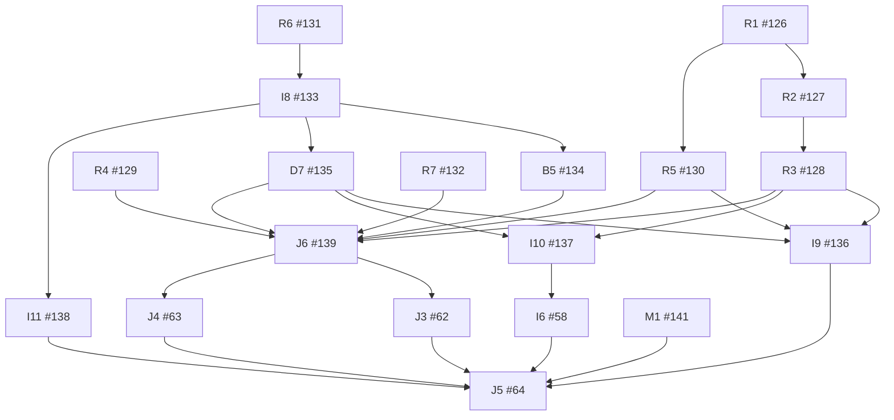

# Core dependency graph

Snapshot reconciled on 2026-09-12 against reviewed application `4aa1cc64b3ecab669c76ffa672832d4c5638ac68`. Native GitHub blockers determine current readiness. There are 160 core edges and one external planning edge, A0 blocked by completed #13.

## Remaining work

Arrows point from prerequisite to consumer. Historical closed prerequisites are listed in the complete table below.

## Scheduling and ownership

R1 and R4 can run independently of R6 and R7. R2 follows R1 because both own clarification persistence; R3 follows R2 because both change deletion execution. R5 follows R1 because it consumes the new resolution evidence in Memory and Co teraz. R3 owns push/service-worker routes; R5 owns in-app links and export targets.

R6 supplies executable release tooling before I8 provisions and proves its real target. B5, D7 and I11 can run independently after I8, with separate fixtures and resource reservations. I9 waits for R5 because the export format gains source targets. I10 waits for R3 so backups contain the repaired lifecycle state. I6 consumes complete backup manifests, not business export archives, and therefore does not wait for I9.

J6 waits for B5 so its joined proof uses ordinary real authentication. J3 and J4 consume its recorded candidate. Start J4 promptly once ready; its Google observation needs more than seven real elapsed days. Parallel lanes still serialize schema/configuration writers and reserve distinct tenants, accounts, bucket namespaces and notification destinations. Qualification evidence is rechecked after changes to its relevant code, provider, configuration or fixture.

## Complete direct dependency inventory

| Key | Cached state | Direct native blockers | Role |
| --- | --- | --- | --- |
| [A0 #65](https://github.com/wojtekpiskorz/kiero/issues/65) | CLOSED | None; [planning #13](https://github.com/wojtekpiskorz/kiero/issues/13) | Historical implementation |
| [A1 #16](https://github.com/wojtekpiskorz/kiero/issues/16) | CLOSED | [A0 #65](https://github.com/wojtekpiskorz/kiero/issues/65) | Historical implementation |
| [A2 #17](https://github.com/wojtekpiskorz/kiero/issues/17) | CLOSED | [A1 #16](https://github.com/wojtekpiskorz/kiero/issues/16) | Historical implementation |
| [A3 #18](https://github.com/wojtekpiskorz/kiero/issues/18) | CLOSED | [A2 #17](https://github.com/wojtekpiskorz/kiero/issues/17), [I1 #53](https://github.com/wojtekpiskorz/kiero/issues/53) | Historical implementation |
| [A4 #19](https://github.com/wojtekpiskorz/kiero/issues/19) | CLOSED | [A3 #18](https://github.com/wojtekpiskorz/kiero/issues/18) | Historical implementation |
| [B1 #20](https://github.com/wojtekpiskorz/kiero/issues/20) | CLOSED | [A3 #18](https://github.com/wojtekpiskorz/kiero/issues/18) | Historical implementation |
| [B2 #21](https://github.com/wojtekpiskorz/kiero/issues/21) | CLOSED | [B1 #20](https://github.com/wojtekpiskorz/kiero/issues/20) | Historical implementation |
| [B3 #22](https://github.com/wojtekpiskorz/kiero/issues/22) | CLOSED | [B1 #20](https://github.com/wojtekpiskorz/kiero/issues/20) | Historical implementation |
| [B4 #23](https://github.com/wojtekpiskorz/kiero/issues/23) | CLOSED | [B3 #22](https://github.com/wojtekpiskorz/kiero/issues/22), [B2 #21](https://github.com/wojtekpiskorz/kiero/issues/21) | Historical implementation |
| [C1 #24](https://github.com/wojtekpiskorz/kiero/issues/24) | CLOSED | [B3 #22](https://github.com/wojtekpiskorz/kiero/issues/22) | Historical implementation |
| [C2 #25](https://github.com/wojtekpiskorz/kiero/issues/25) | CLOSED | [B3 #22](https://github.com/wojtekpiskorz/kiero/issues/22) | Historical implementation |
| [C3 #26](https://github.com/wojtekpiskorz/kiero/issues/26) | CLOSED | [C2 #25](https://github.com/wojtekpiskorz/kiero/issues/25) | Historical implementation |
| [C4 #27](https://github.com/wojtekpiskorz/kiero/issues/27) | CLOSED | [C1 #24](https://github.com/wojtekpiskorz/kiero/issues/24), [C2 #25](https://github.com/wojtekpiskorz/kiero/issues/25) | Historical implementation |
| [C5 #28](https://github.com/wojtekpiskorz/kiero/issues/28) | CLOSED | [E3 #37](https://github.com/wojtekpiskorz/kiero/issues/37) | Historical implementation |
| [D1 #29](https://github.com/wojtekpiskorz/kiero/issues/29) | CLOSED | [B3 #22](https://github.com/wojtekpiskorz/kiero/issues/22) | Historical implementation |
| [D2 #30](https://github.com/wojtekpiskorz/kiero/issues/30) | CLOSED | [D1 #29](https://github.com/wojtekpiskorz/kiero/issues/29) | Historical implementation |
| [D3 #31](https://github.com/wojtekpiskorz/kiero/issues/31) | CLOSED | [D2 #30](https://github.com/wojtekpiskorz/kiero/issues/30), [B2 #21](https://github.com/wojtekpiskorz/kiero/issues/21) | Historical implementation |
| [D4 #32](https://github.com/wojtekpiskorz/kiero/issues/32) | CLOSED | [A4 #19](https://github.com/wojtekpiskorz/kiero/issues/19), [D2 #30](https://github.com/wojtekpiskorz/kiero/issues/30) | Historical implementation |
| [D5 #33](https://github.com/wojtekpiskorz/kiero/issues/33) | CLOSED | [D2 #30](https://github.com/wojtekpiskorz/kiero/issues/30) | Historical implementation |
| [D6 #34](https://github.com/wojtekpiskorz/kiero/issues/34) | CLOSED | [D2 #30](https://github.com/wojtekpiskorz/kiero/issues/30), [E2 #36](https://github.com/wojtekpiskorz/kiero/issues/36) | Historical implementation |
| [E1 #35](https://github.com/wojtekpiskorz/kiero/issues/35) | CLOSED | [A0 #65](https://github.com/wojtekpiskorz/kiero/issues/65) | Historical implementation |
| [E2 #36](https://github.com/wojtekpiskorz/kiero/issues/36) | CLOSED | [A3 #18](https://github.com/wojtekpiskorz/kiero/issues/18), [E1 #35](https://github.com/wojtekpiskorz/kiero/issues/35) | Historical implementation |
| [E3 #37](https://github.com/wojtekpiskorz/kiero/issues/37) | CLOSED | [C1 #24](https://github.com/wojtekpiskorz/kiero/issues/24), [C2 #25](https://github.com/wojtekpiskorz/kiero/issues/25), [D1 #29](https://github.com/wojtekpiskorz/kiero/issues/29), [E2 #36](https://github.com/wojtekpiskorz/kiero/issues/36) | Historical implementation |
| [E4 #38](https://github.com/wojtekpiskorz/kiero/issues/38) | CLOSED | [D5 #33](https://github.com/wojtekpiskorz/kiero/issues/33), [D6 #34](https://github.com/wojtekpiskorz/kiero/issues/34), [E3 #37](https://github.com/wojtekpiskorz/kiero/issues/37) | Historical implementation |
| [E5 #39](https://github.com/wojtekpiskorz/kiero/issues/39) | CLOSED | [C2 #25](https://github.com/wojtekpiskorz/kiero/issues/25), [D1 #29](https://github.com/wojtekpiskorz/kiero/issues/29), [E2 #36](https://github.com/wojtekpiskorz/kiero/issues/36) | Historical implementation |
| [E6 #40](https://github.com/wojtekpiskorz/kiero/issues/40) | CLOSED | [C3 #26](https://github.com/wojtekpiskorz/kiero/issues/26), [C4 #27](https://github.com/wojtekpiskorz/kiero/issues/27), [C5 #28](https://github.com/wojtekpiskorz/kiero/issues/28) | Historical implementation |
| [F1 #41](https://github.com/wojtekpiskorz/kiero/issues/41) | CLOSED | [D1 #29](https://github.com/wojtekpiskorz/kiero/issues/29) | Historical implementation |
| [F2 #42](https://github.com/wojtekpiskorz/kiero/issues/42) | CLOSED | [F1 #41](https://github.com/wojtekpiskorz/kiero/issues/41), [E3 #37](https://github.com/wojtekpiskorz/kiero/issues/37) | Historical implementation |
| [F3 #43](https://github.com/wojtekpiskorz/kiero/issues/43) | CLOSED | [F2 #42](https://github.com/wojtekpiskorz/kiero/issues/42), [A4 #19](https://github.com/wojtekpiskorz/kiero/issues/19), [B2 #21](https://github.com/wojtekpiskorz/kiero/issues/21) | Historical implementation |
| [F4 #44](https://github.com/wojtekpiskorz/kiero/issues/44) | CLOSED | [C4 #27](https://github.com/wojtekpiskorz/kiero/issues/27), [F2 #42](https://github.com/wojtekpiskorz/kiero/issues/42) | Historical implementation |
| [G1 #45](https://github.com/wojtekpiskorz/kiero/issues/45) | CLOSED | [B3 #22](https://github.com/wojtekpiskorz/kiero/issues/22) | Historical implementation |
| [G2 #46](https://github.com/wojtekpiskorz/kiero/issues/46) | CLOSED | [C4 #27](https://github.com/wojtekpiskorz/kiero/issues/27), [G1 #45](https://github.com/wojtekpiskorz/kiero/issues/45) | Historical implementation |
| [G3 #47](https://github.com/wojtekpiskorz/kiero/issues/47) | CLOSED | [G2 #46](https://github.com/wojtekpiskorz/kiero/issues/46) | Historical implementation |
| [G4 #48](https://github.com/wojtekpiskorz/kiero/issues/48) | CLOSED | [G3 #47](https://github.com/wojtekpiskorz/kiero/issues/47), [A4 #19](https://github.com/wojtekpiskorz/kiero/issues/19) | Historical implementation |
| [H1 #49](https://github.com/wojtekpiskorz/kiero/issues/49) | CLOSED | [F1 #41](https://github.com/wojtekpiskorz/kiero/issues/41), [J1 #60](https://github.com/wojtekpiskorz/kiero/issues/60) | Historical implementation |
| [H2 #50](https://github.com/wojtekpiskorz/kiero/issues/50) | CLOSED | [A4 #19](https://github.com/wojtekpiskorz/kiero/issues/19), [C3 #26](https://github.com/wojtekpiskorz/kiero/issues/26), [F4 #44](https://github.com/wojtekpiskorz/kiero/issues/44) | Historical implementation |
| [H3 #51](https://github.com/wojtekpiskorz/kiero/issues/51) | CLOSED | [A4 #19](https://github.com/wojtekpiskorz/kiero/issues/19), [E5 #39](https://github.com/wojtekpiskorz/kiero/issues/39), [D3 #31](https://github.com/wojtekpiskorz/kiero/issues/31), [C5 #28](https://github.com/wojtekpiskorz/kiero/issues/28) | Historical implementation |
| [H4 #52](https://github.com/wojtekpiskorz/kiero/issues/52) | CLOSED | [A4 #19](https://github.com/wojtekpiskorz/kiero/issues/19), [B4 #23](https://github.com/wojtekpiskorz/kiero/issues/23), [E3 #37](https://github.com/wojtekpiskorz/kiero/issues/37), [I2 #54](https://github.com/wojtekpiskorz/kiero/issues/54) | Historical implementation |
| [I1 #53](https://github.com/wojtekpiskorz/kiero/issues/53) | CLOSED | [A0 #65](https://github.com/wojtekpiskorz/kiero/issues/65) | Historical implementation |
| [I2 #54](https://github.com/wojtekpiskorz/kiero/issues/54) | CLOSED | [A3 #18](https://github.com/wojtekpiskorz/kiero/issues/18) | Historical implementation |
| [I3 #55](https://github.com/wojtekpiskorz/kiero/issues/55) | CLOSED | [C3 #26](https://github.com/wojtekpiskorz/kiero/issues/26), [C4 #27](https://github.com/wojtekpiskorz/kiero/issues/27), [D3 #31](https://github.com/wojtekpiskorz/kiero/issues/31) | Historical implementation |
| [I4 #56](https://github.com/wojtekpiskorz/kiero/issues/56) | CLOSED | [C5 #28](https://github.com/wojtekpiskorz/kiero/issues/28), [E5 #39](https://github.com/wojtekpiskorz/kiero/issues/39), [F3 #43](https://github.com/wojtekpiskorz/kiero/issues/43), [G3 #47](https://github.com/wojtekpiskorz/kiero/issues/47), [I3 #55](https://github.com/wojtekpiskorz/kiero/issues/55), [E4 #38](https://github.com/wojtekpiskorz/kiero/issues/38), [I2 #54](https://github.com/wojtekpiskorz/kiero/issues/54) | Historical implementation |
| [I5 #57](https://github.com/wojtekpiskorz/kiero/issues/57) | CLOSED | [D3 #31](https://github.com/wojtekpiskorz/kiero/issues/31), [I2 #54](https://github.com/wojtekpiskorz/kiero/issues/54) | Historical implementation |
| [I6 #58](https://github.com/wojtekpiskorz/kiero/issues/58) | OPEN | [I4 #56](https://github.com/wojtekpiskorz/kiero/issues/56), [I5 #57](https://github.com/wojtekpiskorz/kiero/issues/57), [I10 #137](https://github.com/wojtekpiskorz/kiero/issues/137) | Remaining execution |
| [I7 #59](https://github.com/wojtekpiskorz/kiero/issues/59) | CLOSED | [D4 #32](https://github.com/wojtekpiskorz/kiero/issues/32), [F3 #43](https://github.com/wojtekpiskorz/kiero/issues/43), [I2 #54](https://github.com/wojtekpiskorz/kiero/issues/54) | Historical implementation |
| [J1 #60](https://github.com/wojtekpiskorz/kiero/issues/60) | CLOSED | [A4 #19](https://github.com/wojtekpiskorz/kiero/issues/19), [E3 #37](https://github.com/wojtekpiskorz/kiero/issues/37) | Historical implementation |
| [J2 #61](https://github.com/wojtekpiskorz/kiero/issues/61) | CLOSED | [D4 #32](https://github.com/wojtekpiskorz/kiero/issues/32), [E4 #38](https://github.com/wojtekpiskorz/kiero/issues/38), [E6 #40](https://github.com/wojtekpiskorz/kiero/issues/40), [H2 #50](https://github.com/wojtekpiskorz/kiero/issues/50), [H3 #51](https://github.com/wojtekpiskorz/kiero/issues/51), [H4 #52](https://github.com/wojtekpiskorz/kiero/issues/52), [H1 #49](https://github.com/wojtekpiskorz/kiero/issues/49) | Historical implementation |
| [J3 #62](https://github.com/wojtekpiskorz/kiero/issues/62) | OPEN | [J2 #61](https://github.com/wojtekpiskorz/kiero/issues/61), [J6 #139](https://github.com/wojtekpiskorz/kiero/issues/139) | Remaining execution |
| [J4 #63](https://github.com/wojtekpiskorz/kiero/issues/63) | OPEN | [J2 #61](https://github.com/wojtekpiskorz/kiero/issues/61), [G4 #48](https://github.com/wojtekpiskorz/kiero/issues/48), [G5 #107](https://github.com/wojtekpiskorz/kiero/issues/107), [I7 #59](https://github.com/wojtekpiskorz/kiero/issues/59), [J6 #139](https://github.com/wojtekpiskorz/kiero/issues/139) | Remaining execution |
| [J5 #64](https://github.com/wojtekpiskorz/kiero/issues/64) | OPEN | [I6 #58](https://github.com/wojtekpiskorz/kiero/issues/58), [J3 #62](https://github.com/wojtekpiskorz/kiero/issues/62), [J4 #63](https://github.com/wojtekpiskorz/kiero/issues/63), [I9 #136](https://github.com/wojtekpiskorz/kiero/issues/136), [I11 #138](https://github.com/wojtekpiskorz/kiero/issues/138), [M1 #141](https://github.com/wojtekpiskorz/kiero/issues/141) | Remaining execution |
| [G5 #107](https://github.com/wojtekpiskorz/kiero/issues/107) | CLOSED | [G2 #46](https://github.com/wojtekpiskorz/kiero/issues/46), [G4 #48](https://github.com/wojtekpiskorz/kiero/issues/48) | Historical implementation |
| [E7 #115](https://github.com/wojtekpiskorz/kiero/issues/115) | CLOSED | [C5 #28](https://github.com/wojtekpiskorz/kiero/issues/28), [H3 #51](https://github.com/wojtekpiskorz/kiero/issues/51) | Historical implementation |
| [R1 #126](https://github.com/wojtekpiskorz/kiero/issues/126) | OPEN | [M0 #125](https://github.com/wojtekpiskorz/kiero/issues/125), [C2 #25](https://github.com/wojtekpiskorz/kiero/issues/25), [E6 #40](https://github.com/wojtekpiskorz/kiero/issues/40), [H1 #49](https://github.com/wojtekpiskorz/kiero/issues/49), [H2 #50](https://github.com/wojtekpiskorz/kiero/issues/50) | Remaining execution |
| [R2 #127](https://github.com/wojtekpiskorz/kiero/issues/127) | OPEN | [R1 #126](https://github.com/wojtekpiskorz/kiero/issues/126), [I4 #56](https://github.com/wojtekpiskorz/kiero/issues/56) | Remaining execution |
| [R3 #128](https://github.com/wojtekpiskorz/kiero/issues/128) | OPEN | [R2 #127](https://github.com/wojtekpiskorz/kiero/issues/127), [F3 #43](https://github.com/wojtekpiskorz/kiero/issues/43), [F4 #44](https://github.com/wojtekpiskorz/kiero/issues/44) | Remaining execution |
| [R4 #129](https://github.com/wojtekpiskorz/kiero/issues/129) | OPEN | [M0 #125](https://github.com/wojtekpiskorz/kiero/issues/125), [E7 #115](https://github.com/wojtekpiskorz/kiero/issues/115) | Remaining execution |
| [R5 #130](https://github.com/wojtekpiskorz/kiero/issues/130) | OPEN | [R1 #126](https://github.com/wojtekpiskorz/kiero/issues/126), [H3 #51](https://github.com/wojtekpiskorz/kiero/issues/51) | Remaining execution |
| [R6 #131](https://github.com/wojtekpiskorz/kiero/issues/131) | OPEN | [M0 #125](https://github.com/wojtekpiskorz/kiero/issues/125), [I7 #59](https://github.com/wojtekpiskorz/kiero/issues/59) | Remaining execution |
| [R7 #132](https://github.com/wojtekpiskorz/kiero/issues/132) | OPEN | [M0 #125](https://github.com/wojtekpiskorz/kiero/issues/125), [G3 #47](https://github.com/wojtekpiskorz/kiero/issues/47) | Remaining execution |
| [I8 #133](https://github.com/wojtekpiskorz/kiero/issues/133) | OPEN | [R6 #131](https://github.com/wojtekpiskorz/kiero/issues/131), [I1 #53](https://github.com/wojtekpiskorz/kiero/issues/53), [I2 #54](https://github.com/wojtekpiskorz/kiero/issues/54) | Remaining execution |
| [B5 #134](https://github.com/wojtekpiskorz/kiero/issues/134) | OPEN | [I8 #133](https://github.com/wojtekpiskorz/kiero/issues/133), [B2 #21](https://github.com/wojtekpiskorz/kiero/issues/21), [B3 #22](https://github.com/wojtekpiskorz/kiero/issues/22), [B4 #23](https://github.com/wojtekpiskorz/kiero/issues/23) | Remaining execution |
| [D7 #135](https://github.com/wojtekpiskorz/kiero/issues/135) | OPEN | [I8 #133](https://github.com/wojtekpiskorz/kiero/issues/133), [D5 #33](https://github.com/wojtekpiskorz/kiero/issues/33), [D6 #34](https://github.com/wojtekpiskorz/kiero/issues/34), [E4 #38](https://github.com/wojtekpiskorz/kiero/issues/38), [D3 #31](https://github.com/wojtekpiskorz/kiero/issues/31) | Remaining execution |
| [I9 #136](https://github.com/wojtekpiskorz/kiero/issues/136) | OPEN | [R3 #128](https://github.com/wojtekpiskorz/kiero/issues/128), [D7 #135](https://github.com/wojtekpiskorz/kiero/issues/135), [I3 #55](https://github.com/wojtekpiskorz/kiero/issues/55), [R5 #130](https://github.com/wojtekpiskorz/kiero/issues/130) | Remaining execution |
| [I10 #137](https://github.com/wojtekpiskorz/kiero/issues/137) | OPEN | [R3 #128](https://github.com/wojtekpiskorz/kiero/issues/128), [D7 #135](https://github.com/wojtekpiskorz/kiero/issues/135), [I5 #57](https://github.com/wojtekpiskorz/kiero/issues/57) | Remaining execution |
| [I11 #138](https://github.com/wojtekpiskorz/kiero/issues/138) | OPEN | [I8 #133](https://github.com/wojtekpiskorz/kiero/issues/133), [I2 #54](https://github.com/wojtekpiskorz/kiero/issues/54) | Remaining execution |
| [J6 #139](https://github.com/wojtekpiskorz/kiero/issues/139) | OPEN | [R3 #128](https://github.com/wojtekpiskorz/kiero/issues/128), [R4 #129](https://github.com/wojtekpiskorz/kiero/issues/129), [R5 #130](https://github.com/wojtekpiskorz/kiero/issues/130), [R7 #132](https://github.com/wojtekpiskorz/kiero/issues/132), [D7 #135](https://github.com/wojtekpiskorz/kiero/issues/135), [B5 #134](https://github.com/wojtekpiskorz/kiero/issues/134) | Remaining execution |
| [M0 #125](https://github.com/wojtekpiskorz/kiero/issues/125) | CLOSED | None | Map administration |
| [M1 #141](https://github.com/wojtekpiskorz/kiero/issues/141) | OPEN | [M0 #125](https://github.com/wojtekpiskorz/kiero/issues/125) | Map administration |

Administration rows are documentation work, not core features. Their cached states change only through bounded administration PRs that rerun the audit and keep every derived cell equal to the manifest.
