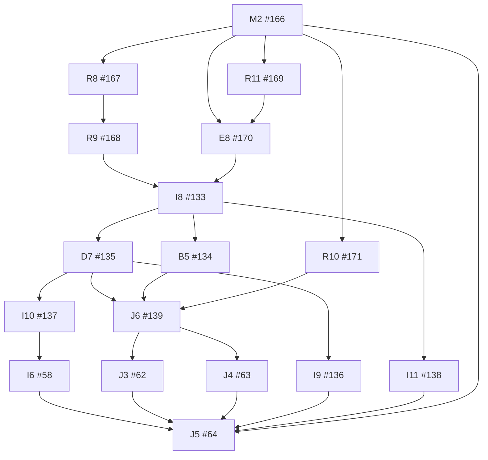

# Core dependency graph

Snapshot reconciled on 2026-09-14. Historical reviewed application `4aa1cc64b3ecab669c76ffa672832d4c5638ac68`. Native GitHub blockers determine current readiness. There are 178 core edges and one external planning edge, A0 blocked by completed #13.

## Remaining work

Arrows point from prerequisite to consumer. Historical closed prerequisites are listed in the complete table below.

## Scheduling and ownership

The repaired clarification lane is ordered by ownership: R2 follows the closed R1 because both own clarification persistence; R3 follows R2 because both change deletion execution; R5 consumed R1's resolution evidence for in-app links and export targets and closed with its live-leg record (the 121-newer-messages direct open, the legacy redirect and the refusal screens on the dev/i4 lease). R3 owns push/service-worker routes.

R8 supplies Workers hosting and R9 verifies the actual Convex target. R11 precedes E8 to serialize dependency changes. I8 resumes after R9/E8; R10 also gates J6. M2 gates dispatch until this map update is integrated. R6 is historical release tooling, not proof of the new candidate. B5, D7 and I11 can run independently after I8, with separate fixtures and resource reservations. I9 waits for R5 because the export format gains source targets. I10 waits for R3 so backups contain the repaired lifecycle state. I6 consumes complete backup manifests, not business export archives, and therefore does not wait for I9.

J6 waits for B5 so its joined proof uses ordinary real authentication. J3 and J4 consume its recorded candidate. Start J4 promptly once ready; its Google observation needs more than seven real elapsed days. Parallel lanes still serialize schema/configuration writers and reserve distinct tenants, accounts, bucket namespaces and notification destinations. Qualification evidence is rechecked after changes to its relevant code, provider, configuration or fixture.

## Complete direct dependency inventory

| Key | Cached state | Direct native blockers | Role |
| --- | --- | --- | --- |
| [A0 #65](https://github.com/wojtekpiskorz/kiero/issues/65) | CLOSED | None; [planning #13](https://github.com/wojtekpiskorz/kiero/issues/13) | Integrated work |
| [A1 #16](https://github.com/wojtekpiskorz/kiero/issues/16) | CLOSED | [A0 #65](https://github.com/wojtekpiskorz/kiero/issues/65) | Integrated work |
| [A2 #17](https://github.com/wojtekpiskorz/kiero/issues/17) | CLOSED | [A1 #16](https://github.com/wojtekpiskorz/kiero/issues/16) | Integrated work |
| [A3 #18](https://github.com/wojtekpiskorz/kiero/issues/18) | CLOSED | [A2 #17](https://github.com/wojtekpiskorz/kiero/issues/17), [I1 #53](https://github.com/wojtekpiskorz/kiero/issues/53) | Integrated work |
| [A4 #19](https://github.com/wojtekpiskorz/kiero/issues/19) | CLOSED | [A3 #18](https://github.com/wojtekpiskorz/kiero/issues/18) | Integrated work |
| [B1 #20](https://github.com/wojtekpiskorz/kiero/issues/20) | CLOSED | [A3 #18](https://github.com/wojtekpiskorz/kiero/issues/18) | Integrated work |
| [B2 #21](https://github.com/wojtekpiskorz/kiero/issues/21) | CLOSED | [B1 #20](https://github.com/wojtekpiskorz/kiero/issues/20) | Integrated work |
| [B3 #22](https://github.com/wojtekpiskorz/kiero/issues/22) | CLOSED | [B1 #20](https://github.com/wojtekpiskorz/kiero/issues/20) | Integrated work |
| [B4 #23](https://github.com/wojtekpiskorz/kiero/issues/23) | CLOSED | [B3 #22](https://github.com/wojtekpiskorz/kiero/issues/22), [B2 #21](https://github.com/wojtekpiskorz/kiero/issues/21) | Integrated work |
| [C1 #24](https://github.com/wojtekpiskorz/kiero/issues/24) | CLOSED | [B3 #22](https://github.com/wojtekpiskorz/kiero/issues/22) | Integrated work |
| [C2 #25](https://github.com/wojtekpiskorz/kiero/issues/25) | CLOSED | [B3 #22](https://github.com/wojtekpiskorz/kiero/issues/22) | Integrated work |
| [C3 #26](https://github.com/wojtekpiskorz/kiero/issues/26) | CLOSED | [C2 #25](https://github.com/wojtekpiskorz/kiero/issues/25) | Integrated work |
| [C4 #27](https://github.com/wojtekpiskorz/kiero/issues/27) | CLOSED | [C1 #24](https://github.com/wojtekpiskorz/kiero/issues/24), [C2 #25](https://github.com/wojtekpiskorz/kiero/issues/25) | Integrated work |
| [C5 #28](https://github.com/wojtekpiskorz/kiero/issues/28) | CLOSED | [E3 #37](https://github.com/wojtekpiskorz/kiero/issues/37) | Integrated work |
| [D1 #29](https://github.com/wojtekpiskorz/kiero/issues/29) | CLOSED | [B3 #22](https://github.com/wojtekpiskorz/kiero/issues/22) | Integrated work |
| [D2 #30](https://github.com/wojtekpiskorz/kiero/issues/30) | CLOSED | [D1 #29](https://github.com/wojtekpiskorz/kiero/issues/29) | Integrated work |
| [D3 #31](https://github.com/wojtekpiskorz/kiero/issues/31) | CLOSED | [D2 #30](https://github.com/wojtekpiskorz/kiero/issues/30), [B2 #21](https://github.com/wojtekpiskorz/kiero/issues/21) | Integrated work |
| [D4 #32](https://github.com/wojtekpiskorz/kiero/issues/32) | CLOSED | [A4 #19](https://github.com/wojtekpiskorz/kiero/issues/19), [D2 #30](https://github.com/wojtekpiskorz/kiero/issues/30) | Integrated work |
| [D5 #33](https://github.com/wojtekpiskorz/kiero/issues/33) | CLOSED | [D2 #30](https://github.com/wojtekpiskorz/kiero/issues/30) | Integrated work |
| [D6 #34](https://github.com/wojtekpiskorz/kiero/issues/34) | CLOSED | [D2 #30](https://github.com/wojtekpiskorz/kiero/issues/30), [E2 #36](https://github.com/wojtekpiskorz/kiero/issues/36) | Integrated work |
| [E1 #35](https://github.com/wojtekpiskorz/kiero/issues/35) | CLOSED | [A0 #65](https://github.com/wojtekpiskorz/kiero/issues/65) | Integrated work |
| [E2 #36](https://github.com/wojtekpiskorz/kiero/issues/36) | CLOSED | [A3 #18](https://github.com/wojtekpiskorz/kiero/issues/18), [E1 #35](https://github.com/wojtekpiskorz/kiero/issues/35) | Integrated work |
| [E3 #37](https://github.com/wojtekpiskorz/kiero/issues/37) | CLOSED | [C1 #24](https://github.com/wojtekpiskorz/kiero/issues/24), [C2 #25](https://github.com/wojtekpiskorz/kiero/issues/25), [D1 #29](https://github.com/wojtekpiskorz/kiero/issues/29), [E2 #36](https://github.com/wojtekpiskorz/kiero/issues/36) | Integrated work |
| [E4 #38](https://github.com/wojtekpiskorz/kiero/issues/38) | CLOSED | [D5 #33](https://github.com/wojtekpiskorz/kiero/issues/33), [D6 #34](https://github.com/wojtekpiskorz/kiero/issues/34), [E3 #37](https://github.com/wojtekpiskorz/kiero/issues/37) | Integrated work |
| [E5 #39](https://github.com/wojtekpiskorz/kiero/issues/39) | CLOSED | [C2 #25](https://github.com/wojtekpiskorz/kiero/issues/25), [D1 #29](https://github.com/wojtekpiskorz/kiero/issues/29), [E2 #36](https://github.com/wojtekpiskorz/kiero/issues/36) | Integrated work |
| [E6 #40](https://github.com/wojtekpiskorz/kiero/issues/40) | CLOSED | [C3 #26](https://github.com/wojtekpiskorz/kiero/issues/26), [C4 #27](https://github.com/wojtekpiskorz/kiero/issues/27), [C5 #28](https://github.com/wojtekpiskorz/kiero/issues/28) | Integrated work |
| [F1 #41](https://github.com/wojtekpiskorz/kiero/issues/41) | CLOSED | [D1 #29](https://github.com/wojtekpiskorz/kiero/issues/29) | Integrated work |
| [F2 #42](https://github.com/wojtekpiskorz/kiero/issues/42) | CLOSED | [F1 #41](https://github.com/wojtekpiskorz/kiero/issues/41), [E3 #37](https://github.com/wojtekpiskorz/kiero/issues/37) | Integrated work |
| [F3 #43](https://github.com/wojtekpiskorz/kiero/issues/43) | CLOSED | [F2 #42](https://github.com/wojtekpiskorz/kiero/issues/42), [A4 #19](https://github.com/wojtekpiskorz/kiero/issues/19), [B2 #21](https://github.com/wojtekpiskorz/kiero/issues/21) | Integrated work |
| [F4 #44](https://github.com/wojtekpiskorz/kiero/issues/44) | CLOSED | [C4 #27](https://github.com/wojtekpiskorz/kiero/issues/27), [F2 #42](https://github.com/wojtekpiskorz/kiero/issues/42) | Integrated work |
| [G1 #45](https://github.com/wojtekpiskorz/kiero/issues/45) | CLOSED | [B3 #22](https://github.com/wojtekpiskorz/kiero/issues/22) | Integrated work |
| [G2 #46](https://github.com/wojtekpiskorz/kiero/issues/46) | CLOSED | [C4 #27](https://github.com/wojtekpiskorz/kiero/issues/27), [G1 #45](https://github.com/wojtekpiskorz/kiero/issues/45) | Integrated work |
| [G3 #47](https://github.com/wojtekpiskorz/kiero/issues/47) | CLOSED | [G2 #46](https://github.com/wojtekpiskorz/kiero/issues/46) | Integrated work |
| [G4 #48](https://github.com/wojtekpiskorz/kiero/issues/48) | CLOSED | [G3 #47](https://github.com/wojtekpiskorz/kiero/issues/47), [A4 #19](https://github.com/wojtekpiskorz/kiero/issues/19) | Integrated work |
| [H1 #49](https://github.com/wojtekpiskorz/kiero/issues/49) | CLOSED | [F1 #41](https://github.com/wojtekpiskorz/kiero/issues/41), [J1 #60](https://github.com/wojtekpiskorz/kiero/issues/60) | Integrated work |
| [H2 #50](https://github.com/wojtekpiskorz/kiero/issues/50) | CLOSED | [A4 #19](https://github.com/wojtekpiskorz/kiero/issues/19), [C3 #26](https://github.com/wojtekpiskorz/kiero/issues/26), [F4 #44](https://github.com/wojtekpiskorz/kiero/issues/44) | Integrated work |
| [H3 #51](https://github.com/wojtekpiskorz/kiero/issues/51) | CLOSED | [A4 #19](https://github.com/wojtekpiskorz/kiero/issues/19), [E5 #39](https://github.com/wojtekpiskorz/kiero/issues/39), [D3 #31](https://github.com/wojtekpiskorz/kiero/issues/31), [C5 #28](https://github.com/wojtekpiskorz/kiero/issues/28) | Integrated work |
| [H4 #52](https://github.com/wojtekpiskorz/kiero/issues/52) | CLOSED | [A4 #19](https://github.com/wojtekpiskorz/kiero/issues/19), [B4 #23](https://github.com/wojtekpiskorz/kiero/issues/23), [E3 #37](https://github.com/wojtekpiskorz/kiero/issues/37), [I2 #54](https://github.com/wojtekpiskorz/kiero/issues/54) | Integrated work |
| [I1 #53](https://github.com/wojtekpiskorz/kiero/issues/53) | CLOSED | [A0 #65](https://github.com/wojtekpiskorz/kiero/issues/65) | Integrated work |
| [I2 #54](https://github.com/wojtekpiskorz/kiero/issues/54) | CLOSED | [A3 #18](https://github.com/wojtekpiskorz/kiero/issues/18) | Integrated work |
| [I3 #55](https://github.com/wojtekpiskorz/kiero/issues/55) | CLOSED | [C3 #26](https://github.com/wojtekpiskorz/kiero/issues/26), [C4 #27](https://github.com/wojtekpiskorz/kiero/issues/27), [D3 #31](https://github.com/wojtekpiskorz/kiero/issues/31) | Integrated work |
| [I4 #56](https://github.com/wojtekpiskorz/kiero/issues/56) | CLOSED | [C5 #28](https://github.com/wojtekpiskorz/kiero/issues/28), [E5 #39](https://github.com/wojtekpiskorz/kiero/issues/39), [F3 #43](https://github.com/wojtekpiskorz/kiero/issues/43), [G3 #47](https://github.com/wojtekpiskorz/kiero/issues/47), [I3 #55](https://github.com/wojtekpiskorz/kiero/issues/55), [E4 #38](https://github.com/wojtekpiskorz/kiero/issues/38), [I2 #54](https://github.com/wojtekpiskorz/kiero/issues/54) | Integrated work |
| [I5 #57](https://github.com/wojtekpiskorz/kiero/issues/57) | CLOSED | [D3 #31](https://github.com/wojtekpiskorz/kiero/issues/31), [I2 #54](https://github.com/wojtekpiskorz/kiero/issues/54) | Integrated work |
| [I6 #58](https://github.com/wojtekpiskorz/kiero/issues/58) | OPEN | [I4 #56](https://github.com/wojtekpiskorz/kiero/issues/56), [I5 #57](https://github.com/wojtekpiskorz/kiero/issues/57), [I10 #137](https://github.com/wojtekpiskorz/kiero/issues/137) | Remaining execution |
| [I7 #59](https://github.com/wojtekpiskorz/kiero/issues/59) | CLOSED | [D4 #32](https://github.com/wojtekpiskorz/kiero/issues/32), [F3 #43](https://github.com/wojtekpiskorz/kiero/issues/43), [I2 #54](https://github.com/wojtekpiskorz/kiero/issues/54) | Integrated work |
| [J1 #60](https://github.com/wojtekpiskorz/kiero/issues/60) | CLOSED | [A4 #19](https://github.com/wojtekpiskorz/kiero/issues/19), [E3 #37](https://github.com/wojtekpiskorz/kiero/issues/37) | Integrated work |
| [J2 #61](https://github.com/wojtekpiskorz/kiero/issues/61) | CLOSED | [D4 #32](https://github.com/wojtekpiskorz/kiero/issues/32), [E4 #38](https://github.com/wojtekpiskorz/kiero/issues/38), [E6 #40](https://github.com/wojtekpiskorz/kiero/issues/40), [H2 #50](https://github.com/wojtekpiskorz/kiero/issues/50), [H3 #51](https://github.com/wojtekpiskorz/kiero/issues/51), [H4 #52](https://github.com/wojtekpiskorz/kiero/issues/52), [H1 #49](https://github.com/wojtekpiskorz/kiero/issues/49) | Integrated work |
| [J3 #62](https://github.com/wojtekpiskorz/kiero/issues/62) | OPEN | [J2 #61](https://github.com/wojtekpiskorz/kiero/issues/61), [J6 #139](https://github.com/wojtekpiskorz/kiero/issues/139) | Remaining execution |
| [J4 #63](https://github.com/wojtekpiskorz/kiero/issues/63) | OPEN | [J2 #61](https://github.com/wojtekpiskorz/kiero/issues/61), [G4 #48](https://github.com/wojtekpiskorz/kiero/issues/48), [G5 #107](https://github.com/wojtekpiskorz/kiero/issues/107), [I7 #59](https://github.com/wojtekpiskorz/kiero/issues/59), [J6 #139](https://github.com/wojtekpiskorz/kiero/issues/139) | Remaining execution |
| [J5 #64](https://github.com/wojtekpiskorz/kiero/issues/64) | OPEN | [I6 #58](https://github.com/wojtekpiskorz/kiero/issues/58), [J3 #62](https://github.com/wojtekpiskorz/kiero/issues/62), [J4 #63](https://github.com/wojtekpiskorz/kiero/issues/63), [I9 #136](https://github.com/wojtekpiskorz/kiero/issues/136), [I11 #138](https://github.com/wojtekpiskorz/kiero/issues/138), [M1 #141](https://github.com/wojtekpiskorz/kiero/issues/141), [M2 #166](https://github.com/wojtekpiskorz/kiero/issues/166) | Remaining execution |
| [G5 #107](https://github.com/wojtekpiskorz/kiero/issues/107) | CLOSED | [G2 #46](https://github.com/wojtekpiskorz/kiero/issues/46), [G4 #48](https://github.com/wojtekpiskorz/kiero/issues/48) | Integrated work |
| [E7 #115](https://github.com/wojtekpiskorz/kiero/issues/115) | CLOSED | [C5 #28](https://github.com/wojtekpiskorz/kiero/issues/28), [H3 #51](https://github.com/wojtekpiskorz/kiero/issues/51) | Integrated work |
| [R1 #126](https://github.com/wojtekpiskorz/kiero/issues/126) | CLOSED | [M0 #125](https://github.com/wojtekpiskorz/kiero/issues/125), [C2 #25](https://github.com/wojtekpiskorz/kiero/issues/25), [E6 #40](https://github.com/wojtekpiskorz/kiero/issues/40), [H1 #49](https://github.com/wojtekpiskorz/kiero/issues/49), [H2 #50](https://github.com/wojtekpiskorz/kiero/issues/50) | Integrated work |
| [R2 #127](https://github.com/wojtekpiskorz/kiero/issues/127) | CLOSED | [R1 #126](https://github.com/wojtekpiskorz/kiero/issues/126), [I4 #56](https://github.com/wojtekpiskorz/kiero/issues/56) | Integrated work |
| [R3 #128](https://github.com/wojtekpiskorz/kiero/issues/128) | CLOSED | [R2 #127](https://github.com/wojtekpiskorz/kiero/issues/127), [F3 #43](https://github.com/wojtekpiskorz/kiero/issues/43), [F4 #44](https://github.com/wojtekpiskorz/kiero/issues/44) | Integrated work |
| [R4 #129](https://github.com/wojtekpiskorz/kiero/issues/129) | CLOSED | [M0 #125](https://github.com/wojtekpiskorz/kiero/issues/125), [E7 #115](https://github.com/wojtekpiskorz/kiero/issues/115) | Integrated work |
| [R5 #130](https://github.com/wojtekpiskorz/kiero/issues/130) | CLOSED | [R1 #126](https://github.com/wojtekpiskorz/kiero/issues/126), [H3 #51](https://github.com/wojtekpiskorz/kiero/issues/51) | Integrated work |
| [R6 #131](https://github.com/wojtekpiskorz/kiero/issues/131) | CLOSED | [M0 #125](https://github.com/wojtekpiskorz/kiero/issues/125), [I7 #59](https://github.com/wojtekpiskorz/kiero/issues/59) | Integrated work |
| [R7 #132](https://github.com/wojtekpiskorz/kiero/issues/132) | CLOSED | [M0 #125](https://github.com/wojtekpiskorz/kiero/issues/125), [G3 #47](https://github.com/wojtekpiskorz/kiero/issues/47) | Integrated work |
| [I8 #133](https://github.com/wojtekpiskorz/kiero/issues/133) | OPEN | [R6 #131](https://github.com/wojtekpiskorz/kiero/issues/131), [I1 #53](https://github.com/wojtekpiskorz/kiero/issues/53), [I2 #54](https://github.com/wojtekpiskorz/kiero/issues/54), [R9 #168](https://github.com/wojtekpiskorz/kiero/issues/168), [E8 #170](https://github.com/wojtekpiskorz/kiero/issues/170) | Remaining execution |
| [B5 #134](https://github.com/wojtekpiskorz/kiero/issues/134) | OPEN | [I8 #133](https://github.com/wojtekpiskorz/kiero/issues/133), [B2 #21](https://github.com/wojtekpiskorz/kiero/issues/21), [B3 #22](https://github.com/wojtekpiskorz/kiero/issues/22), [B4 #23](https://github.com/wojtekpiskorz/kiero/issues/23) | Remaining execution |
| [D7 #135](https://github.com/wojtekpiskorz/kiero/issues/135) | OPEN | [I8 #133](https://github.com/wojtekpiskorz/kiero/issues/133), [D5 #33](https://github.com/wojtekpiskorz/kiero/issues/33), [D6 #34](https://github.com/wojtekpiskorz/kiero/issues/34), [E4 #38](https://github.com/wojtekpiskorz/kiero/issues/38), [D3 #31](https://github.com/wojtekpiskorz/kiero/issues/31) | Remaining execution |
| [I9 #136](https://github.com/wojtekpiskorz/kiero/issues/136) | OPEN | [R3 #128](https://github.com/wojtekpiskorz/kiero/issues/128), [D7 #135](https://github.com/wojtekpiskorz/kiero/issues/135), [I3 #55](https://github.com/wojtekpiskorz/kiero/issues/55), [R5 #130](https://github.com/wojtekpiskorz/kiero/issues/130) | Remaining execution |
| [I10 #137](https://github.com/wojtekpiskorz/kiero/issues/137) | OPEN | [R3 #128](https://github.com/wojtekpiskorz/kiero/issues/128), [D7 #135](https://github.com/wojtekpiskorz/kiero/issues/135), [I5 #57](https://github.com/wojtekpiskorz/kiero/issues/57) | Remaining execution |
| [I11 #138](https://github.com/wojtekpiskorz/kiero/issues/138) | OPEN | [I8 #133](https://github.com/wojtekpiskorz/kiero/issues/133), [I2 #54](https://github.com/wojtekpiskorz/kiero/issues/54) | Remaining execution |
| [J6 #139](https://github.com/wojtekpiskorz/kiero/issues/139) | OPEN | [R3 #128](https://github.com/wojtekpiskorz/kiero/issues/128), [R4 #129](https://github.com/wojtekpiskorz/kiero/issues/129), [R5 #130](https://github.com/wojtekpiskorz/kiero/issues/130), [R7 #132](https://github.com/wojtekpiskorz/kiero/issues/132), [D7 #135](https://github.com/wojtekpiskorz/kiero/issues/135), [B5 #134](https://github.com/wojtekpiskorz/kiero/issues/134), [R10 #171](https://github.com/wojtekpiskorz/kiero/issues/171) | Remaining execution |
| [M0 #125](https://github.com/wojtekpiskorz/kiero/issues/125) | CLOSED | None | Integrated work |
| [M1 #141](https://github.com/wojtekpiskorz/kiero/issues/141) | CLOSED | [M0 #125](https://github.com/wojtekpiskorz/kiero/issues/125) | Integrated work |
| [M2 #166](https://github.com/wojtekpiskorz/kiero/issues/166) | OPEN | [M1 #141](https://github.com/wojtekpiskorz/kiero/issues/141) | Remaining execution |
| [R8 #167](https://github.com/wojtekpiskorz/kiero/issues/167) | OPEN | [M2 #166](https://github.com/wojtekpiskorz/kiero/issues/166), [R6 #131](https://github.com/wojtekpiskorz/kiero/issues/131), [I1 #53](https://github.com/wojtekpiskorz/kiero/issues/53), [A4 #19](https://github.com/wojtekpiskorz/kiero/issues/19) | Remaining execution |
| [R9 #168](https://github.com/wojtekpiskorz/kiero/issues/168) | OPEN | [R8 #167](https://github.com/wojtekpiskorz/kiero/issues/167), [R6 #131](https://github.com/wojtekpiskorz/kiero/issues/131) | Remaining execution |
| [R11 #169](https://github.com/wojtekpiskorz/kiero/issues/169) | OPEN | [M2 #166](https://github.com/wojtekpiskorz/kiero/issues/166), [B1 #20](https://github.com/wojtekpiskorz/kiero/issues/20) | Remaining execution |
| [E8 #170](https://github.com/wojtekpiskorz/kiero/issues/170) | OPEN | [M2 #166](https://github.com/wojtekpiskorz/kiero/issues/166), [E2 #36](https://github.com/wojtekpiskorz/kiero/issues/36), [R11 #169](https://github.com/wojtekpiskorz/kiero/issues/169) | Remaining execution |
| [R10 #171](https://github.com/wojtekpiskorz/kiero/issues/171) | OPEN | [M2 #166](https://github.com/wojtekpiskorz/kiero/issues/166), [G1 #45](https://github.com/wojtekpiskorz/kiero/issues/45) | Remaining execution |
