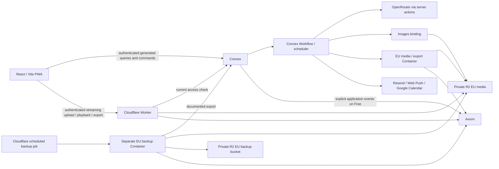

# Kiero architecture design

Accepted through Q211 on 2026-09-08. This artifact describes the structure selected in [Grilling: architektura, stack i hosting MVP](https://github.com/wojtekpiskorz/kiero/issues/11). The resolution comment is the canonical decision. This is a concrete design for implementation, not an installed or tested application. The [proof matrix](architecture-proof-matrix.md) records what remains to be demonstrated.

## Deployment and ownership

One TypeScript repository owns the PWA, Convex functions, shared contracts, Workers and Container entry points. The PWA uses React, Vite, TanStack Router and TanStack Query, with client rendering and Workers Static Assets hosting. Normal data access uses generated Convex calls and the Convex Query adapter; Workers do not duplicate a general application CRUD API.

Convex owns current state, history, transactions, reactive reads and durable job state. Effect 4 RC owns domain computation, errors, dependencies and integration orchestration inside that execution model. TanStack AI owns model/tool invocation and streaming. Use `@convex-dev/workflow` and the native scheduler as the first durable execution path. Do not add another canonical workflow engine in Effect Cluster or Cloudflare Workflows.

Database, files and backups use EU placement; R2 uses explicit EU jurisdiction. Media and backup Containers use EU jurisdiction too. Globally routed Worker execution is not automatically EU-only compute. AI processing outside the EU is accepted. Local development, synthetic staging and alpha production remain separate environments.

## Deep modules

These module interfaces describe behavior and invariants, not a requirement for one class or package per row. Operation names below establish the English vocabulary; final callable signatures follow the typed contract proof.

| Module | Small public interface | Complexity owned inside the module |
| --- | --- | --- |
| Access | Resolve current access, accept/revoke invitation, change membership, link verified method, revoke session, enter audited GM mode | Identity and membership separation, one active firm in v1, explicit linking, last-admin constraints, device/session revocation, background and media checks |
| Sources and media | Prepare/resume upload, accept source, read source/fragment, withdraw or permanently delete source, request firm export | One immutable logical source, all-attachment acceptance, representation versions, streaming/ranges, local/server upload reconciliation, retained-image policy, dependent cleanup |
| Memory | Read current findings, prepare and publish checked changes, resolve clarification, re-evaluate affected findings, retrieve evidence | Typed states, immutable revisions, support/derivation/supersession, stale-plan checks, extension definitions, independent corroboration, current versus historical retrieval |
| Projects and work | Identify/create project, assign/rename codename, change project/task/event, complete checklist point | Contact roles, stable identity, independently completed parent task, separate event/task semantics, open obligations after project closure |
| Notifications | Mark a source read, change personal preferences, snooze a task, evaluate and deliver due intents | Shared source identity across views, batching, quiet hours, current recipients, duplicate suppression, validity after data/access changes |
| Integrations | Execute approved extraction/model call, connect/reconcile Calendar, send application email | Provider-specific decoding, capability-aware fallback, external outcome uncertainty, account lifecycle, event mapping, bounded retries |
| Operations | Inspect/retry processing, run reanalysis, build/verify/restore recovery set, emit diagnostic event | Audited GM actions, pipeline versions, backup completeness, external deletion/revocation ledger, retention, health and cost alerts |

UI and agent requests use the same checked domain operations. An agent plan is untrusted input. Server code resolves the actor and firm, validates the command and relevant revisions, and controls persistence. An agent cannot issue arbitrary database writes or grant itself GM access. Clear changes remain autonomous; ambiguity follows the existing clarification contract.

Use native Convex validators and generated/inferred types for persisted records and callable APIs. Effect Schema decodes model/provider input and richer domain values. Share definitions where the pinned integrations permit it; otherwise use checked typed mappings. Avoid manually duplicated frontend interfaces, unchecked casts and a hypothetical universal schema compiler. Dynamic extension labels cannot become compile-time TypeScript keys before they exist.

## Logical data dictionary

The following bounded record families implement the agreed model. Names are the selected design vocabulary, not deployed Convex schemas. Fields listed here are the load-bearing fields; timestamps, validators and indexes must be completed under the same invariants. Provider auth/component tables remain owned by their packages and must be included in access and recovery proofs.

| Record family | Important references and fields | Integrity rule |
| --- | --- | --- |
| `companies`, `memberships`, `invitations` | Company timezone; user/company/role/state; targeted invite identity, expiry and revocation | Server resolves current access. Contacts and equal email addresses never confer membership. Multi-membership structure supports one active firm for an ordinary v1 user. |
| `contacts`, `contactRoles` | Company, person/organization, names/aliases/contact details; project/task relationship and role | A party can be client, executor or supplier without creating a new identity per role. User linking remains explicit. |
| `projects`, `projectAliases` | Company, client/location, current stage and pause details; alias/project identity and history | Ordinary names may collide. Assigned codenames are firm-unique across retained history and stay reserved through rename/closure. |
| `sources`, `sourceProjectLinks` | Company, immutable author/message text, original send intention, timezone snapshot, full acceptance time, source lifecycle; versioned retained-media references, project and relevant fragment links | One source may concern several projects. Project conversations project the same source and authorship; they do not copy editable originals. |
| `uploads`, `attachments`, `mediaRepresentations` | Draft/source, server-owned object identity, part manifest; received/retained/thumbnail/processing representation, hashes, dimensions, transform version | Never accept a source before all required attachments are durable. Finalized objects cannot be overwritten by stale retries. |
| `extractions`, `sourceFragments` | Source/representation, extraction version, model/provider/run; text offset, audio interval, image region or whole-source reference | New STT/vision creates another immutable extraction version. Historical evidence never silently moves to new coordinates or different bytes. |
| `findings`, `findingRevisions` | Stable finding identity and semantic scope; value/knowledge state, basis, actor, recorded time, effective time if known | Stable identity survives a schema or field refactor. Revisions are immutable. Current state is readable without replaying the conversation. |
| `evidenceLinks`, `findingDependencies` | Revision and source fragment; typed support, independent corroboration, derivation and supersession | Derivations are acyclic; inference is not another witness. Deletion/correction can locate affected dependents without discarding independent evidence. |
| `tasks`, `checklistItems`, `events` | Project, state, executor/contact, coordinator/member, temporal finding bindings; parent task and item state | Task completion is independent of checklist completion. Event occurrence and task deadline are distinct unless they explicitly share an agreement. |
| `extensionDefinitions`, `extensionVersions`, `extensionUsage` | Shared or firm-scoped definition, stable field IDs, versioned shape, usage counts | Definitions are bounded data, never executable schema code. Reuse and similarity checks precede creating near-duplicates. Historic values retain their definition version. |
| `changeSets`, `publicationGroups`, `clarifications` | Source/run, group identity, expected relevant revisions, applied changes, unresolved question, author/answer linkage | Each dependent group publishes atomically. Independent projects may complete separately; partial processing is visible. |
| `processingRuns`, `processingSteps`, `attempts` | Source, workflow/prompt/schema/model configuration version, checkpoint, outcome, output reference, retry/reanalysis linkage | Retry preserves source identity and compatible run semantics. Reanalysis is a linked new run and cannot overwrite a newer correction. |
| `readStates`, `notificationPreferences`, `notificationIntents`, `pushSubscriptions` | Source/user state; mute/quiet hours/snooze; recipient and semantic delivery identity; current device/session | Read state belongs to the logical source and user. Recheck rights, freshness and intent validity before external delivery. |
| `calendarConnections`, `calendarCopies`, `calendarSyncState` | User/company/Google identity, dedicated calendar ID, entity/copy ID, personal hide, desired revision, remote outcome/cursor | Connection lifecycle is separate from sign-in. Unknown remote outcomes require reconciliation; another POST is not automatically safe. |
| `exports`, `exportSourceLinks`, `recoveryManifests` | Consistent company snapshot, availability and invalidation; included sources; verified database/media manifest and snapshot time | Firm exports exclude other tenants and credentials. Permanent deletion invalidates affected downloads immediately. A backup is complete only after reference verification. |
| `auditRecords`, `diagnosticEvents`, derived search records | Actor and change/run references; allowed technical metadata; index generation/source revision | Audit is canonical protected data. Diagnostics are redacted and limited to the accepted window. Search indexes are disposable derived data, not authority. |

Source immutability preserves the logical message, user-authored text and authorship. It does not require retaining received camera bytes after the accepted checked normalization process. Each retained representation and extraction version remains an honest inspectable evidence target; the photo replacement/exception policy below governs received-byte retention. Lifecycle changes and checked representation selection are explicit operations.

Do not store the whole conversation, project graph, attempt history or multi-hour transcript in one growing document. Paginate conversations and history, store large artifacts in protected object storage and keep bounded indexed records in Convex. Every company-owned family carries or resolves company scope through a checked relationship.

Index for the actual reads: company plus conversation order; company/project current work; stable source and finding identity; current revision/dependency lookups; due workflow/notification state; user/source read state; user/company Calendar mapping; export/source invalidation. Exact composite indexes and denormalized columns follow measured query plans and Convex limits. Current list projections update atomically with their authoritative finding changes and are never separately editable.

## Value contracts

- Knowledge is `known`, `unknown` with a reason, `conflicted`, or `not_applicable` only where meaningful. These states are separate from extraction confidence and business progress. Omission in a patch means no change. Clearing, withdrawal and conflict are explicit operations, not arbitrary model `null` values erasing a fact.
- Temporal values distinguish local date, zoned date/time with resolved instant when justified, and range. Keep original expression, precision and role such as proposal, internal plan, agreed or actual. Preserve justified bounds without inventing an hour or exact day. Source `sentAt` and timezone snapshot anchor relative language; `fullyAcceptedAt` starts processing latency. Validate implausible client clock evidence and ask when the intended day is materially uncertain.
- A financial finding keeps business role/scope, currency and its origin, exact decimal amount or range, precision and tax basis. Known net and gross may coexist. An unspecified quoted basis remains `not_specified`; never infer VAT. Use decimal-safe arithmetic. Changing the basis creates a revision rather than rewriting history.
- Typed extensions support text, quantity/unit, boolean, enum, financial and temporal values, supported entity references, objects and bounded lists. Stable field IDs outlive label changes. New definition versions preserve the interpretation of historic data; incompatible changes require an explicit migration or new definition.
- `recordedAt` is trusted system time. `effectiveAt` or its range exists only when evidence establishes when the agreement applied. Neither backdating nor the last-arriving analysis automatically defeats an explicit correction.

## Source processing and publication protocol

1. The client saves a stable draft and recording data incrementally. Explicit Send begins resumable upload; browser eviction/recovery limitations remain honest. A project pill offers context and does not force every clause into that project.
2. The Worker checks current access throughout upload and owns object keys/part identities. It finalizes and verifies required attachments in R2. R2 completion and Convex acceptance are separate systems, so an upload ledger and safe orphan reconciliation are required.
3. `acceptSource` checks all attachment references and current authorization, records one source and atomically registers durable processing. Only this completion yields the saved receipt. The exact Workflow integration must prove atomic registration.
4. Normalize accepted photos before ordinary vision. Verify the durable readable archival representation and its reference/recovery conditions before removing temporary received bytes. Retain the original on unsupported conversion, failure or unresolved quality. Audio remains playable in alpha; processing segments retain original-time mappings and do not create new messages.
5. Run versioned STT/vision and prepare bounded source-linked information groups. A missing required segment is pending, not a complete transcript. Text-only fallback cannot claim to have inspected a pending image.
6. Read relevant current structured state, discover evidence with tenant-filtered text/vector retrieval where useful, and record the revisions used in a change plan. Similarity does not establish truth. Relevant newer accepted sources still processing must be acknowledged in an answer; unrelated backlog does not block independent confirmed information.
7. Publish each logically dependent group in a checked mutation. Recheck actor/company/source validity, expected revisions and semantic invariants. Write current values, immutable revisions, provenance and required durable side-effect intents together. A delivery event and its deliberately linked receiving task publish together; independent information for another project can complete separately.
8. Stale plans obtain current context and are reconsidered. Explicit clear corrections supersede the old current value with history retained. An ambiguous contradiction produces a sourced clarification. Dependent inferred conclusions become updating until revalidated and cannot drive automation; unrelated findings remain usable.
9. External delivery runs after durable intent. Record attempts, semantic deduplication identity and known/unknown outcome. Current rights and business state are checked again before sending. A timeout after provider success does not justify duplicate publication or blind Calendar creation.

GM can inspect stages, attempts and source-backed changes, retry a failed stage or explicitly request a linked reanalysis using the application-approved model configuration. GM does not edit immutable sources or perform ordinary direct database repair as a retry mechanism. GM activity retains its author and remains excluded from alpha success metrics.

## Provider configuration

| Role | Selected candidate/configuration | Required constraint |
| --- | --- | --- |
| Chat / memory analysis | `z-ai/glm-5.3-flash`, then `google/gemini-3.8-flash`, then `deepseek/deepseek-v4-flash-0731` | Application-owned order; compatible tools/schema; bounded retries and deadlines; actual route recorded |
| Images | GLM, then Gemini | DeepSeek may use completed source-linked extraction text. Both image routes failing leaves image extraction pending. |
| Speech-to-text | `microsoft/mai-transcribe-2`, backup `openai/whisper-large-v3` through OpenRouter transcription endpoint | MAI public preview/no SLA caveat accepted as a candidate; faithful Polish speech and timing require proof. STT routing differs from chat. |
| Semantic retrieval | `qwen/qwen3-embedding-8b` through OpenRouter, Convex vectors | Native 4096 dimensions are the initial proof baseline; version text preparation/model/index generation, recheck hydrated evidence |
| AI SDK | TanStack AI with `@tanstack/ai-openrouter`, Chat Completions first | Prove the actual adapter forwarding and selected model/tool/schema combination. Responses beta is not the default. |
| Authentication | Convex Auth first candidate | Beta caveat accepted; enforce proof of both identities before method linking, and live revocation independently of token validity |
| Email | Resend, Free initially | Verified app sender, Polish OTP/invites, server credentials, checked delivery and quota behavior |

More than 100 output tokens per second is the GLM provider-selection target, not a guarantee. Useful slower responses during temporary dips are allowed. Preserve model ordering and measure first useful output plus end-to-end time. A fast advertised provider is not selected until the required tool/schema behavior works.

Vectors are rebuildable. Incompatible model/provider implementation, dimensions or text preparation requires a new index generation and verified cutover. During embedding outages use typed/full-text retrieval and disclose relevant coverage gaps. Do not treat absence of a semantic hit as absence of a fact.

The accepted [AI evaluation plan](ai-evaluation-plan.md) separates extraction, reasoning and full-pipeline results. No model calls or measured provider choice were made in this decision ticket.

## Operations, deployment and service plans

Start with Convex Free. Use Starter for metered overage when sufficient and Professional when native log streams, higher capacity or other required features justify it. Inspect hard caps before they interrupt use. Backup generation/transfer counts toward limits and must be included in the proof. This is a plan decision, not an executed automatic purchase.

Workers Paid supports the selected runtime. Images transformations, Containers, R2, backup traffic, AI and other metered charges are additional. Resend Free and Axiom Personal are initial plans. Axiom's three monitors must cover processing/save incidents, recovery/health and costs with useful context; upgrade if coverage or usage does not fit. Preserve the all-in 400/500 PLN alerts and soft alpha budget. Current prices and limits are dated evidence in [service-plan research](../research/alpha-services-runtime-facts.md), not lifetime prices.

On Convex Free, Axiom receives explicit redacted application events and Cloudflare diagnostics. Native Convex platform log streaming waits for Pro; dashboard/CLI recent logs do not become a promised 30-day platform archive. Retain ingested technical events for the agreed window and keep sources in protected Kiero records. External missing-health detection must still find total backend silence. General telemetry excludes raw messages, audio/images, transcripts, prompts and tokens. Avoid building a separate log platform just to postpone Pro.

Run the dedicated EU backup Container every 15 minutes. Verify a complete database snapshot and referenced retained media in a private R2 EU backup bucket with separate permissions. Measure freshness from snapshot time and warn before one hour. Keep frequent complete sets for 48 hours and daily sets through day 14. Media cleanup follows surviving manifest references. At most one hour of loss and restoration within eight hours are targets requiring a real drill; one provider/account failure may affect both application and backups.

Permanently deleted sources become inaccessible immediately, active/reconstructing derivatives are purged within 24 hours, and isolated backup content expires within 30 days. A content-free deletion/revocation ledger survives application DB rollback. Restore in quarantine, apply current deletions/revocations, reconcile media and unknown external outcomes, restore executable code/configuration and scheduler behavior, then permit access and external work. Old sessions and canceled effects must not revive from a snapshot.

Firm exports are background archives containing an HTML index, versioned JSON, history and retained media at a consistent snapshot time. Downloads require current administrator access and are available for 24 hours after completion. Later permanent source deletion invalidates affected archives immediately. Platform backups and auth secrets are never a firm export.

GitHub Actions checks a pinned release, deploys synthetic staging, and exposes an explicit production trigger. Expand the backend compatibly, run resumable migrations, release the client and remove old support later. Keep executable support for old in-flight workflow versions or explicitly migrate them. A PWA update prompts in Polish at a safe point after preserving drafts; it cannot force reload during recording or upload. Normal release recovery is a compatible code rollback or forward fix, not discarding new data with an automatic database restore.

## Deliberate limits of this decision

The owner deferred Q195's formal privacy/retention review. OpenRouter is selected with simple server-owned configuration and optional payload logging/reuse opt-ins off. Outside-EU AI acceptance and a consent checkbox do not establish provider retention or legal compliance. No new formal approval gate or training-consent flow is introduced here.

Exact package pins, encoder profiles, route timeouts, instance sizes and indexes require the agreed integration proofs. Visual design/component choices belong to the Prototype ticket. The following readiness ticket owns final proof acceptance and implementation sequencing. The architecture choice is complete; application readiness is not.
